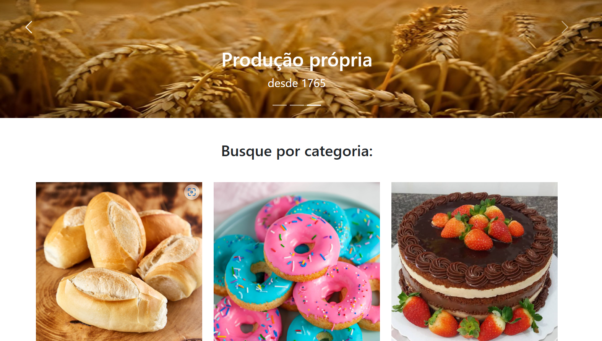

# Padock

A Padock é uma padaria meramente ilustrativa, sem fins lucrativos.

## 🔨 Funcionalidades do projeto

O objetivo do projeto é a especialização em bootstrap. Se trata de   um framework front-end que fornece estruturas de CSS para a criação de sites e aplicações responsivas de forma rápida e simples. Disponível para versões mobile, tablet e desktop.

## ✔️ Técnicas e tecnologias utilizadas

-`HTML`
-`CSS`
-`Bootstrap`
-`Acessibilidade Web`

## 🛠️ Abrir e rodar o projeto

Para abrir e rodar o projeto, utilize um editor de código de sua escolha.
Depois, abra o projeto no seu navegador.

## VERCEL 
https://padock.vercel.app/
